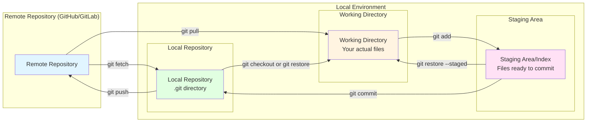
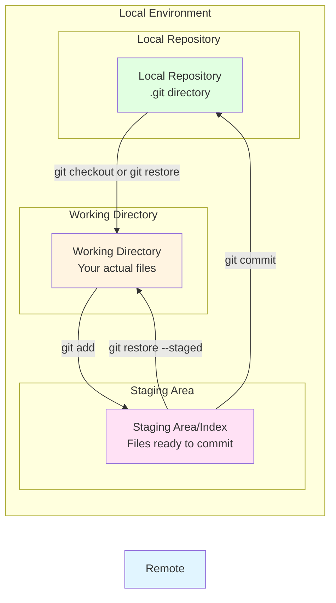
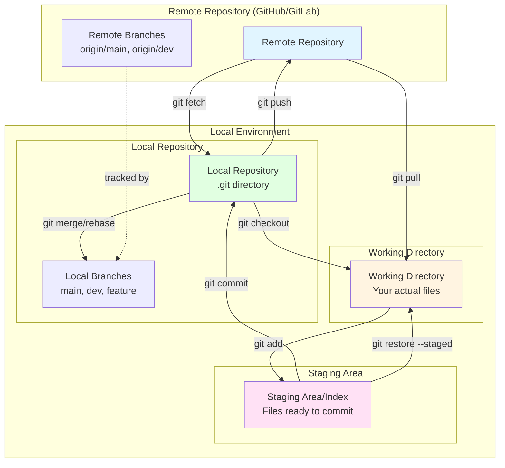
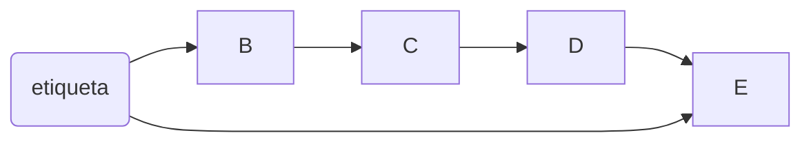

# Lab 1: Primer contacto con Git y GitHub

## Objetivos 
- Primer contacto con Git y GitHub
- Mostrar los casos de uso más habituales con Git/GitHub


## Puesta a punto del entorno de trabajo
Si no se ha hecho ya, se recomienda crear un entorno virtual para realizar las prácticas de la asignatura, cuidando especialmente que la versión tanto de Python como de Arcade sean las adecuadas.

>[!WARNING] 
> La versiones que se recomienda utilizar para evitar problemas son la 3.10 de Python y la 2.6.17 de Arcade.

Una vez preparado el entorno de trabajo, introduciremos algunos de los escenarios más comunes para trabajar con Git y GitHub.

## Escenario 1: Crear un repositorio nuevo desde GitHub
En este escenario partimos sin repositorios de ningún tipo, por lo que partimos de cero. La forma más sencilla para trabajar de este modo es, posiblemente, crear un repositorio vacío en GitHub, y luego clonarlo para poder empezar a trabajar con él en local.

Para poner en práctica este escenario haz la siguientes tareas:

1. Crea un nuevo repositorio llamado "prueba", da igual si es privado o público, en GitHub.
2. Clona el repositorio "prueba".

Con esto ya tenemos creado un repositorio local con el que poder empezar a trabajar. Ya puedes, por ejemplo, agregar archivos nuevos al repositorio y publicar sus cambios en GitHub. Sigamos implementando un flujo de trabajo habitual trabajando con el repositorio recién creado.

3. Crea un nuevo archivo llamado "sumar.py" que contenga un script escrito en Python que muestre por pantalla la suma de los cien primeros números. Puedes utilizar el siguiente código:

```Python
suma = 0
for i in range(1, 101):
    suma += i

print(f"La suma de los primeros 100 números es: {suma}")
```

4. Agrega el archivo recién creado al *staging area*.
5. "Commitea" los cambios.
6. Pushea los cambios.

Felicidades, acabas de realizar tu primer flujo de trabajo completo con Git. Lo habitual es que cada vez que hagas un cambio significativo en el código es que realices un commit.

>[!TIP] 
>Para saber si un cambio es significativo, pregúntate si te dolería perder ese cambio. Si la respuesta es afirmativa, guarda los cambios.

7. Cambia el código anterior para que en vez de calcular la suma de los cien primeros números enteros, haga la multiplicación.
8. Guarda el resultado en GitHub.

>[!CAUTION] Regla de oro
> Nunca, nunca, nunca, "commitees" cambios al respositorio que no hayas testeado previamente. 

``` mermaid
architecture-beta
    group api(cloud)[API]

    service db(database)[Database] in api
    service disk1(disk)[Storage] in api
    service disk2(disk)[Storage] in api
    service server(server)[Server] in api

    db:L -- R:server
    disk1:T -- B:server
    disk2:T -- B:db
    
    group api2(cloud2)[API2]

    service db2(database)[Database] in api2
    service disk12(disk)[Storage] in api2
    service disk22(disk)[Storage] in api2
    service server2(server)[Server] in api2

    db2:L -- R:server2
    disk12:T -- B:server2
    disk22:T -- B:db2
```












### Blablabla
asdfasdf




## Escenario 2: Clonar un repositorio existente en GitHub
El escenario más sencillo, frecuente, y el que usaremos en la asigantura, es empezar a trabajar a partir de un repositorio ya disponible en GitHub. Este escenario se da, por ejemplo, cuando se accede a una plantilla para hacer una práctica, o se quiere colaborar en un proyecto de software libre.

La diferencia, en este caso, es que ya existe un repositorio remoto previo que pertence a un usuario distinto al tuyo, por lo que no tendrás permiso de escritura. Para solucionar esta situación, GitHub nos proporciona la posibilidad de hacer un "fork", que básicamente consiste en copiar un repositorio remoto del que no se es propietario en otro repositorio remoto del que sí eres propietario. Una vez que has hecho un fork, puedes trabajar con el nuevo repositorio con total normalidad.

En este escenario vamos a ejecutar, por primera vez, un Hola Mundo escrito en Arcade, para ello vamos a apoyarnos en un repositorio que guarda un script con el hola mucho, así como una plantilla para hacer este primer bloque de prácticas: https://github.com/dfbarrero/arcade-labs

En base al repositorio con la plantilla, haz las siguientes tareas:

1. "Forkea" el repositorio.
2. Clona el repositorio.
3. Ejecuta el script lab01-git/la01.git.

>[!WARNING] 
> Recuerda que tienes que ejecutar el script dentro de un entorno virtual con la versiones adecuadas tanto de Arcade como de Python.

4. Introduce los cambios que quieras al script, "commiteando" y "pusheando" periódicamente los cambios.


## Escenario 3: Colaborar con un repositorio compartido.
Git por sí mismo es una gran herramienta para gestionar el código en proyectos individuales, pero en donde brilla con más fuerza es facilitando la colaboración de equipos de desarrolladores. Vamos a implementar un flujo de trabajo en equipo utilizanod Git como herramienta de control de versiones.

La dinámica de trabajo en este escenario es la misma que en el caso individual, la única diferencia es que todos los desarrolladores deberían de tener acceso de escritura en un repositorio compartido. Conseguir esto es tan sencillo como que el dueño de un repositorio agregue a los usuarios que estime oportuno en GitHub.

1. Busca a un compañero o compañera para formar un equipo.
2. Uno de los integrantes del equipo debe dar permisos, para ello debe ir a la vista del repositorio que quiera compartir y de a la opción de "*Add people*" dentro de "*Settings->Collaborators*".
3. Los compañeros ahora pueden clonar el respositorio compartido y pushear los cambios al repositorio remoto.


## Escenario 4: Recuperación de fallos
Uno de los motivos por los que se utiliza Git incluso cuando se trabaja individualmente es que, al mantener un control de versiones, facilita que nos recuperemos ante fallos que, sí o sí, van a suceder mientras programamos. Siempre podemos borrar accidentalmente un archivo crítico en algún momento, y es recomendable que estemos preparados para cuando se nos de una situación así. Y esto sucederá.

### Borrado accidental de archivos

4.- ¡CATÁSTROFE! Se acaba de borrar el contenido del directorio lab01-git. Utiliza un navegador de archivos u otra herramienta externa a tu IDE para borrar dicho directorio.

5.- Recupera el directorio borrado. El procedimiento de recuperación depende de si has commiteado, o no, los últimos cambios. En caso de que NO lo hayas commiteado, ejecuta una operación *restore*.

### Regreso a una versión anterior del código